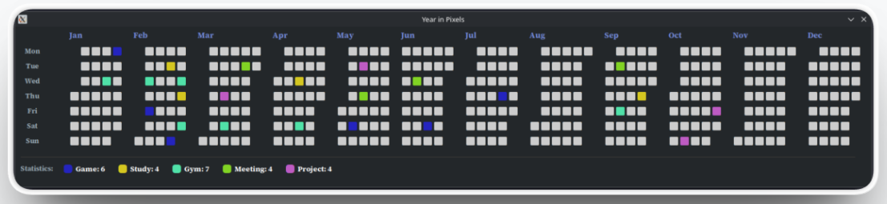
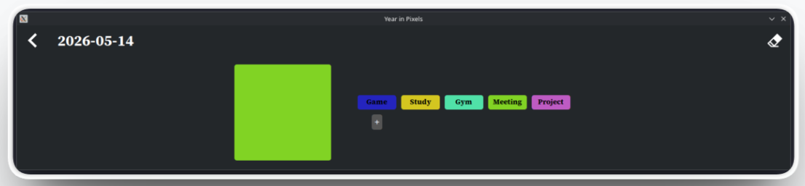

# Years in Pixels

[](https://www.python.org/)
[](LICENSE)
[](https://github.com/RezaAmanii/Years-in-Pixels/issues)
[](https://github.com/RezaAmanii/Years-in-Pixels/commits)
[](https://github.com/RezaAmanii/Years-in-Pixels/releases)

A minimal, desktop-based activity tracking application built with Python and `customtkinter`.

**Years in Pixels** allows you to visualize your entire year in a single, colorful grid like a GitHub contribution graph, giving you a beautiful and minimalistic view of your daily activity over time.


<p float="left">
  
  
</p>

## Features

- **Interactive Yearly Grid:** View your entire year at a glance. Each pixel represents a day.
- **Custom Mood/Activity Palette:** Add, edit, and color-code custom activities or moods to fit your personal tracking needs.
- **Dynamic Statistics:** Automatically calculates and displays the count of each tracked activity/mood.
- **Persistent Local Storage:** Your data is safely stored locally in a lightweight JSON file.


## Installation and Setup

To run this application locally, you will need Python installed on your machine.

1. Clone the repository
```bash
git clone https://github.com/RezaAmanii/Years-in-Pixels.git
cd Years-in-Pixels
```

2. Create a virtual environment (optional but recommended)
```bash
python3 -m venv venv
```

4. Activate the virtual environment:
```bash
source venv/bin/activate
```

5. Install dependencies
```bash
pip install -r requirements.txt
```

6. Run the application
```bash
python3 yearsInPixels.py
```

## How to Use

1. **Log an Activity or Mood:** Click on any square (day) in the calendar grid to open that specific day's detail view. Select an activity or mood from your palette to assign it to that day.
2. **Add a new Activity or Mood:** In the detail view, click **+** button to create a new activity or mood and choose a color using the color picker.
3. **Delete am Activity or Mood:** Right-click (or two-finger tap on Mac) any custom activity/mood button in the detail view to permanently delete it from your palette.
4. **Clear a Day:** Made a mistake? Use the clear icon in the top right of the detail view to reset a day back to default.


## Project Structure

* `yearInPixels.py`: The main entry point and controller of the application.
* `src/config.py`: Contains all application configurations, visual metrics, and default constants.
* `src/dataManager.py`: Handles the reading, writing, and updating of the local JSON data file.
* `src/UI/calendar_view.py`: Renders the main yearly grid and the dynamic statistics sections.
* `src/UI/detail_view.py`: Renders the single day view, mood selection, and color palette management.


## Contributing

Contributions, issues, and feature requests are welcome! Feel free to check the `issue page` if you want to contribute.


## License
This project is licensed under the MIT License - see the `LICENSE` file for details.

